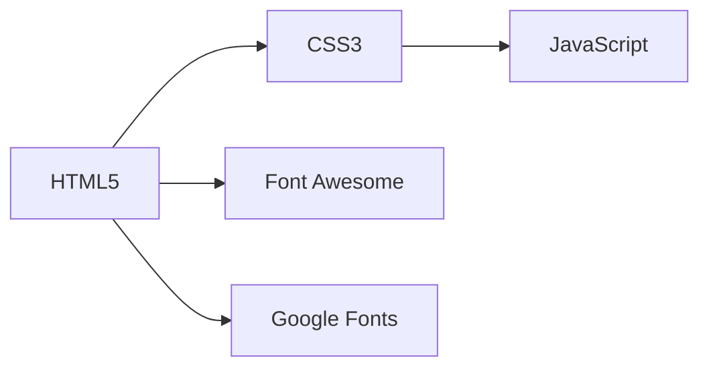

<div align="center">

# 🌐 Personal Portfolio Website

[](https://developer.mozilla.org/en-US/docs/Web/HTML)
[](https://developer.mozilla.org/en-US/docs/Web/CSS)
[](https://developer.mozilla.org/en-US/docs/Web/JavaScript)
[](https://developer.mozilla.org/en-US/docs/Web/Progressive_web_apps)

> *A Comprehensive Digital Portfolio Showcasing Professional Journey*

[🎯 Overview](#-overview) •
[✨ Features](#-features) •
[🛠 Tech Stack](#-tech-stack) •
[🚀 Setup](#-setup) •
[🌈 Sections](#-website-sections) •
[👨‍💻 Author](#-author)

</div>

## 🎯 Overview

The Personal Portfolio Website is a meticulously crafted digital representation of my professional identity as a Java Developer. Designed with modern web technologies, this portfolio provides a comprehensive view of my skills, projects, and professional journey.

The website offers an immersive, interactive experience that goes beyond traditional resume presentation. From animated typing effects to a dynamic theme toggle, every element is carefully designed to showcase my technical skills and creative approach to web development.

## 🌈 Website Sections

### 📍 1. Home Section
- Animated hero section
- Typing text effect
- Code-like visual representation
- Call-to-action buttons

### 👤 2. About Section
- Personal introduction
- Educational background
- Professional summary

### 🛠 3. Skills Section
- Categorized skills display
- Emoji-based skill representation
- Technology stack visualization

### 🚧 4. Projects Section
- Detailed project cards
- Technology stack for each project
- GitHub repository links

### 📄 5. Resume Section
- Embedded PDF resume viewer

### 📞 6. Contact Section
- Social media links
- Direct email contact

## ✨ Features

<table>
<tr>
<td>

### 🎨 Design
- Responsive layout
- Light/Dark theme toggle
- Custom cursor animations
- Animated loading screen

</td>
<td>

### 🔧 Interactivity
- Typing text effect
- Particle background
- Smooth navigation
- Social media integration

</td>
</tr>
<tr>
<td>

### 🌐 Web Technologies
- Semantic HTML5
- Modern CSS3
- Vanilla JavaScript
- Font Awesome icons

</td>
<td>

### 🚀 Performance
- Fast loading
- Minimal external dependencies
- Optimized animations
- Mobile-friendly design

</td>
</tr>
</table>

## 🛠 Tech Stack

### Core Technologies


### Key Components
- **Markup**: HTML5
- **Styling**: CSS3
- **Interactivity**: Vanilla JavaScript
- **Icons**: Font Awesome
- **Fonts**: Google Fonts

## 🚀 Setup

### Prerequisites
- Web Browser (Chrome, Firefox, Safari)
- Text Editor (VS Code, Sublime Text)

### 🔧 Installation Steps
1. **Clone Repository**
```bash
git clone https://github.com/sumanbisunkhe/portfolio-website.git
cd portfolio-website
```

2. **Open Website**
```bash
# Simply open index.html in your browser
```

## 📂 Project Structure

```
portfolio-website/
│
├── css/
│   └── style.css
├── js/
│   └── script.js
├── images/
│   ├── prof.jpeg
│   └── android-chrome-512x512.png
├── docs/
│   └── Suman Bisunkhe Resume.pdf
├── index.html
└── README.md
```

## 🔧 Performance Optimizations

- Minimal external library usage
- Efficient JavaScript
- Optimized image sizes
- Responsive design
- Browser caching support

## 🤝 Contributing

Contributions are welcome! Please follow these steps:

1. Fork the repository
2. Create your feature branch (`git checkout -b feature/AmazingFeature`)
3. Commit your changes (`git commit -m 'Add some AmazingFeature'`)
4. Push to the branch (`git push origin feature/AmazingFeature`)
5. Open a Pull Request

## 👨‍💻 Author

<div align="center">


### Suman Bisunkhe
Java Developer

[](https://github.com/sumanbisunkhe)
[](https://www.linkedin.com/in/sumanbisunkhe)


---

<div align="center">
Made with ❤️ by [Suman Bisunkhe](https://github.com/sumanbisunkhe)
</div>